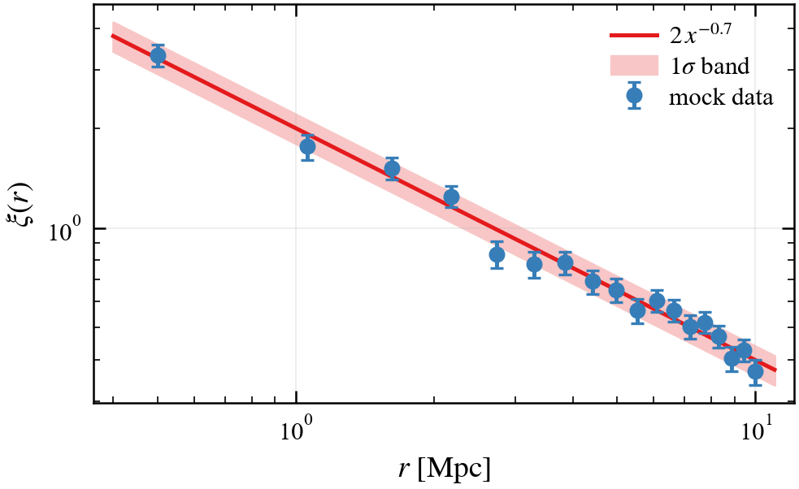
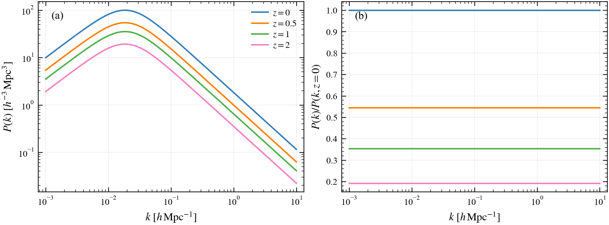
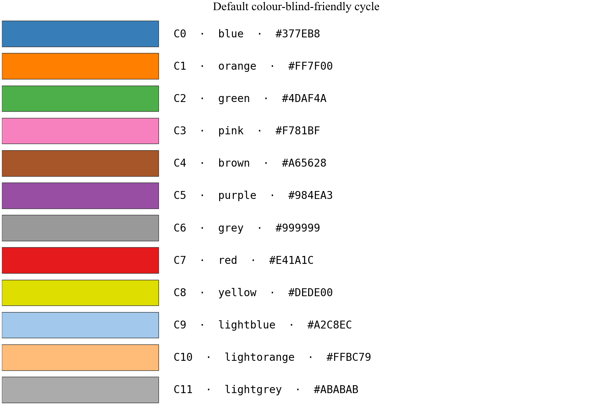
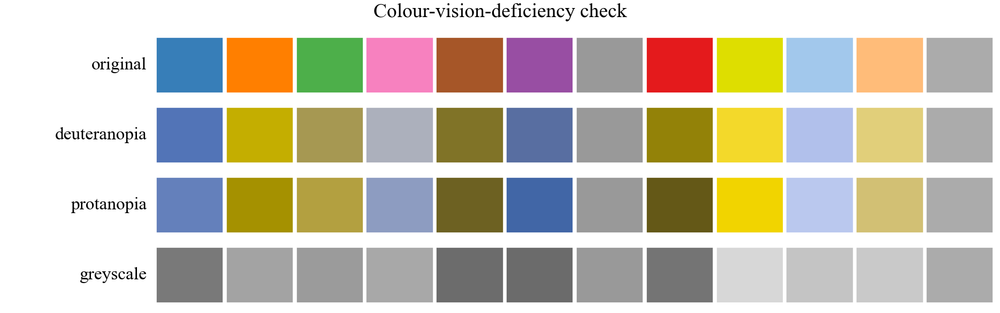
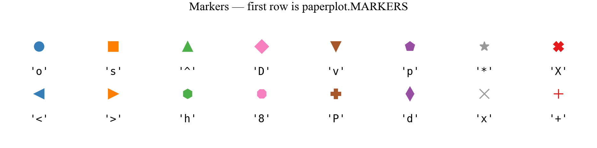
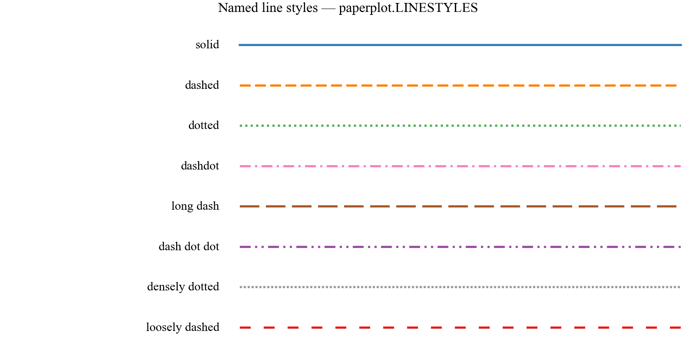
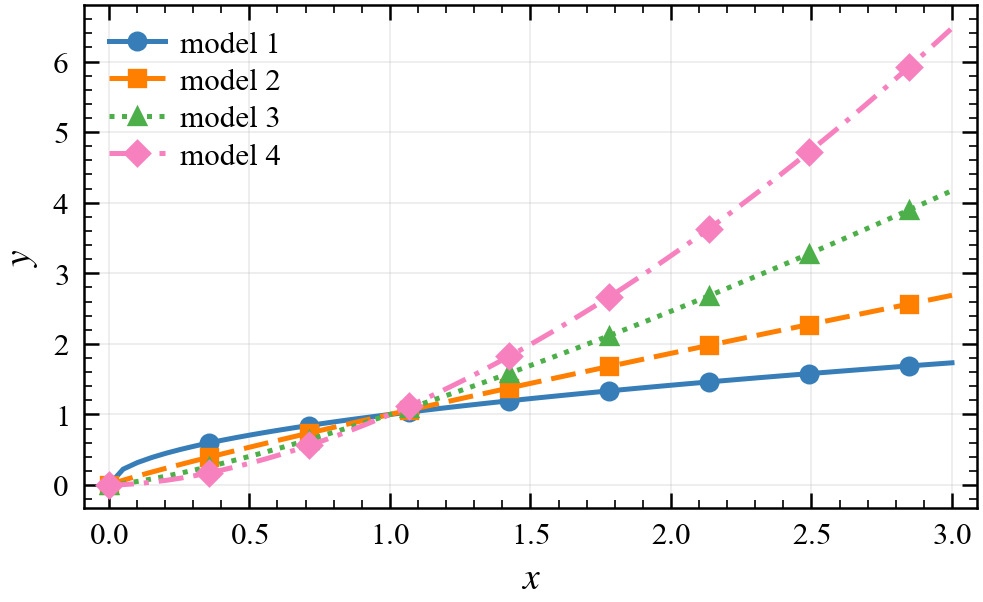

# plotastro

**Publication-quality matplotlib figures for astronomy journals.**

One `pip install` gives you journal-matched styles for **MNRAS**, **RASTI**,
**A&A**, **ApJ/ApJL**, the **Open Journal of Astrophysics**, **PRD/PRL**,
**JCAP** and **Nature Astronomy** — figures at exactly the right physical
size, a colour-blind-friendly palette, and helpers that make the tedious
parts (sizing, panel labels, accessibility checks, saving) one-liners.

```bash
pip install plotastro
```

**Simplest usage — no new API to learn.** Importing plotastro registers the
styles with matplotlib itself; after one `plt.style.use` line you write
ordinary matplotlib, and the default figure size is already the journal's
column width:

```python
import matplotlib.pyplot as plt
import plotastro                 # just to register the styles

plt.style.use("mnras")           # or "aanda", "apj", "oja", "prd", ...
fig, ax = plt.subplots()         # plain matplotlib from here on
```

**With the helpers** (optional, but they make the tedious parts one-liners):

```python
import plotastro as pa

pa.set_style("mnras")
fig, ax = pa.subplots()          # one-column figure, golden-ratio height
ax.plot(x, y, label="model")
ax.set_xlabel("$x$")
ax.legend()
pa.savefig("myplot")             # -> myplot.pdf, ready for \includegraphics
```

| One column | Full width |
|---|---|
|  |  |

**Start with the [tutorial notebook](examples/tutorial.ipynb)** — it walks
through every feature with runnable examples.

## Why this exists

Two problems ruin most paper figures:

1. **Wrong physical size.** If you hand LaTeX a 6-inch figure and it squeezes
   it into an 84 mm column, every label shrinks by ~50 % and becomes
   unreadable. The fix: build the figure at its final printed width, then
   include it with a plain `\includegraphics{fig.pdf}` — no `[width=...]`.
2. **Inaccessible colours.** ~5 % of male readers have a colour-vision
   deficiency, and MNRAS's
   [author guidelines](https://academic.oup.com/mnras/pages/general_instructions)
   explicitly ask for colour-blind-friendly figures. The default matplotlib
   cycle is not; the one here is — and `pa.check_figure()` lets you verify it.

The styles share one visual language — Times-like serif fonts at ~9 pt with
~8 pt tick lettering, inward ticks on all four sides with minors, a subtle
grid, frameless legends — and differ only in figure width (plus the
sans-serif fonts Nature requires), so your plots stay **consistent between
papers** no matter where you submit.

## Supported journals

`pa.set_style(...)`, `pa.figsize(...)` and `plt.style.use(...)` accept
(aliases in parentheses):

| key | journal | one column | full width |
|---|---|---|---|
| `mnras` | Monthly Notices of the RAS | 240.0 pt = 3.32 in | 504.0 pt = 6.97 in |
| `rasti` | RAS Techniques & Instruments | 240.0 pt = 3.32 in | 504.0 pt = 6.97 in |
| `aanda` (`a&a`, `aa`) | Astronomy & Astrophysics | 250.4 pt = 3.46 in (88 mm) | 512.2 pt = 7.09 in (180 mm) |
| `apj` (`apjl`, `aastex`) | The Astrophysical Journal | 242.3 pt = 3.35 in | 513.1 pt = 7.10 in |
| `oja` | Open Journal of Astrophysics | ≈245.3 pt = 3.39 in | ≈508 pt = 7.03 in |
| `prd` (`prl`, `revtex`) | Physical Review D | 246.0 pt = 3.40 in | 510.0 pt = 7.06 in |
| `jcap` | J. Cosmology & Astroparticle Phys. | single-column ≈455 pt = 6.30 in | — |
| `natastro` (`nature`) | Nature Astronomy (sans-serif!) | 253.2 pt = 3.50 in (89 mm) | 520.7 pt = 7.20 in (183 mm) |
| `thesis` | A4 thesis text width | 426.8 pt = 5.91 in | — |
| `beamer` | Beamer slide text width | 307.3 pt = 4.25 in | — |

Widths come from each journal's LaTeX class / author guide. For a custom
document, put `\the\columnwidth` or `\the\textwidth` in your `.tex` body,
compile, read the value off the page, and pass it directly:
`pa.figsize(width=345.0)`.

The only hard dependency is matplotlib; plotastro works with both NumPy 1.x
and 2.x (CI tests each). Running the examples from a clone?
`pip install -r requirements-dev.txt`.

## Tutorial

### Figure sizing

```python
pa.figsize("column")                  # one column, golden-ratio height
pa.figsize("full")                    # full text width
pa.figsize("column", fraction=0.5)    # half a column
pa.figsize("column", aspect=1)        # square panel (aspect = height/width)
pa.figsize("column", journal="aanda") # size for a specific journal
pa.figsize(345.0)                     # any width in LaTeX points
```

`pa.subplots()` takes the same arguments *plus* everything `plt.subplots`
accepts, and scales the height with the grid so each panel keeps its aspect:

```python
fig, ax   = pa.subplots()                          # 1 panel, one column
fig, axes = pa.subplots(2, 2, width="full")        # 2x2 grid, full width
fig, axes = pa.subplots(1, 2, width="full", aspect=0.75, sharey=True)
```

### The colour palette



The default cycle has 12 colours, all accessible by name via `pa.COLORS`
(e.g. `pa.COLORS["blue"]`), or as matplotlib's `"C0"`…`"C11"` shorthands:

- **C0–C8** are a colour-blind-safe re-ordering of the
  [ColorBrewer](https://colorbrewer2.org) *Set1* qualitative palette
  (popularised by [Thøger Rivera-Thorsen's CBcycle](https://gist.github.com/thriveth/8560036)).
  Consecutive colours differ in **lightness as well as hue**, so adjacent
  lines stay distinguishable under the common deficiencies (deuteranopia,
  protanopia) *and* in greyscale print; the notorious red–green pair is
  pushed far apart in the cycle (green is C2, red is C7), so plots with a
  handful of lines never rely on it.
- **C9–C11** are light companions (from Tableau's *Color Blind 10*): use them
  for uncertainty bands, reference curves, or de-emphasised data underneath a
  saturated line of the same hue.

Matched shades without transparency (better for print and EPS):

```python
ax.plot(x, y, color=pa.COLORS["blue"])
ax.fill_between(x, lo, hi, color=pa.lighten(pa.COLORS["blue"], 0.7))
pa.darken(pa.COLORS["orange"], 0.3)     # the other direction
```

Three more palettes ship with the package:

- `pa.OKABE_ITO` — [Okabe & Ito (2008)](https://jfly.uni-koeln.de/color/),
  *the* classic CVD-safe recommendation for categorical colours in science;
- `pa.PETROFF10` — [Petroff (2021)](https://arxiv.org/abs/2107.02270), the
  CVD-optimised 10-colour cycle used across particle physics;
- `pa.PAIRED` — light/dark pairs for data/model or before/after comparisons:
  `pa.PAIRED["blue"]` → `("#a6cee3", "#1f78b4")`.

**Colormaps:** the styles default to `viridis` (perceptually uniform,
CVD-safe). Good picks: `viridis`/`magma`/`cividis` for sequential data,
`RdBu_r` or `coolwarm` for diverging data (red–*blue*, not red–green). Avoid
`jet`/`rainbow`. For more astro-friendly maps see
[cmasher](https://cmasher.readthedocs.io) and [cmocean](https://matplotlib.org/cmocean/).

### Checking accessibility yourself



Don't take the palette's word for it — simulate it
(Machado et al. 2009 model, no extra dependencies):

```python
pa.check_colors()                 # any palette under deuteranopia/protanopia/greyscale
pa.check_colors(pa.PAIRED)        # works on your own colour lists/dicts too
pa.check_figure(fig)              # simulate a whole rendered figure — the
                                  # final check before submission
pa.simulate_cvd("#e41a1c", "deuteranopia")   # the raw transform
```

If two lines merge in any panel, add markers or dash patterns (below), or
pick colours further apart in the cycle. MNRAS recommends
[Color Oracle](https://colororacle.org) and ColorBrewer for exactly this;
now it's built in.

### Markers



`pa.MARKERS = ["o", "s", "^", "D", "v", "p", "*", "X"]` — filled shapes that
survive shrinking to 4 pt. Conventions worth knowing:

| marker | typical use in astro figures |
|---|---|
| `"o"` `"s"` `"D"` | primary data series |
| `"^"` / `"v"` | **lower / upper limits** (readers expect this) |
| `"*"` `"p"` | highlight special objects (the Sun, a best-fit point) |
| `"x"` `"+"` | thin crosses — dense scatter plots, since they don't occlude |
| `"."` | huge point clouds (use `ms=1`–`2`, or better, rasterized hexbin) |

Useful tricks: `markevery=7` thins markers on dense curves;
`mfc="none"` (hollow markers) keeps overlapping datasets readable;
`ms=` and `mew=` control size and edge width.

### Line styles



Beyond matplotlib's `"-"`, `"--"`, `":"`, `"-."`, the dict `pa.LINESTYLES`
provides named dash tuples of the form `(offset, (on, off, ...))` in points:

```python
ax.plot(x, y, ls=pa.LINESTYLES["long dash"])       # (0, (9, 3))
ax.plot(x, y, ls=(0, (4, 1, 1, 1)))                # or roll your own
```

Guidelines: keep to ≤ 4 distinct dash patterns per panel (more becomes
noise); use solid for data / the headline result and dashes/dots for models
and references; MNRAS explicitly warns against triple-dot-dashed lines.

### Redundant encoding — the cycler

Colour should never be the *only* difference between curves. `pa.style_cycler`
advances colour, marker and/or line style **in step**, so every series is
unique in two or three channels at once (and survives greyscale printing):



```python
ax.set_prop_cycle(pa.style_cycler(markers=True))              # one axes
ax.set_prop_cycle(pa.style_cycler(linestyles=True, markers=True))
plt.rc("axes", prop_cycle=pa.style_cycler(markers=True))      # everywhere
```

### Panel labels

Journals want multi-panel figures labelled (a), (b), (c)…:

```python
fig, axes = pa.subplots(2, 2, width="full")
pa.label_panels(axes)                                    # (a) (b) (c) (d)
pa.label_panels(axes, loc="outside", fmt="{}", fontweight="bold")  # Nature style
pa.label_panels(axes, uppercase=True, loc="lower right") # (A) ... bottom-right
```

### LaTeX text rendering

By default the styles use matplotlib **mathtext** with STIX fonts:
Times-compatible maths, zero dependencies. For pixel-perfect agreement with
your manuscript (custom macros, real kerning):

```python
pa.set_style("mnras", usetex=True)   # needs latex + dvipng + ghostscript
```

This loads the `newtx` Times fonts (matching the MNRAS/A&A house font), or
Helvetica for Nature Astronomy. Develop with `usetex=False`, flip it on for
the final version — LaTeX rendering is slow.

### Saving figures

The styles bake in submission-friendly defaults: **PDF** output, 450 dpi for
rasterised elements (journals want ≥ 300–400), tight bounding box, and
TrueType font embedding (`pdf.fonttype: 42`, so no Type-3 font rejections).

```python
pa.savefig("figure1")                              # figure1.pdf
pa.savefig("figure1", formats=("pdf", "png"))      # + a PNG for slides/Slack
pa.savefig("figure1", fig=fig, dpi=600)            # extra options pass through
```

If a journal insists on EPS, note EPS has **no transparency** — replace
`alpha=` with `pa.lighten()` shades (a good habit anyway).

### Author lists from a CSV

Assembling the author/affiliation block by hand is error-prone on long
collaborations. Feed plotastro the author CSV your collaboration already
maintains — it works with real-world lists exactly as they are
(this is [examples/authors_example.csv](examples/authors_example.csv)):

```csv
Lastname,Firstname,Authorname,Email,JoinedAsBuilder,Affiliation,ORCID,
Bandi,Behnood,Behnood Bandi, b.bandi@sussex.ac.uk, False,"Astronomy Centre, University of Sussex, Falmer, Brighton BN1 9QH, UK",0000-0001-5838-3903,
Rocher,Antoine,Antoine Rocher,antoine.rocher@epfl.ch,False,"EPFL, \'{E}cole polytechnique f\'{e}d\'{e}rale de Lausanne, Chemin des Maillettes, 51, 1290 Versoix, Switzerland",0000-0003-4349-6424,
Verdier,Aur\'{e}lien,Aur\'{e}lien Verdier,aurelien.verdier@epfl.ch,False,"EPFL, \'{E}cole polytechnique f\'{e}d\'{e}rale de Lausanne, Chemin des Maillettes, 51, 1290 Versoix, Switzerland",,
Richard,Johan,Johan Richard,johan.richard@univ-lyon1.fr,False,"CRAL, Centre de Recherche Astrophysique de Lyon, Universit\'{e} de Lyon, 9 avenue Charles Andr\'{e}, 69230 Saint-Genis-Laval, France",0000-0001-5492-1049,
Loveday,Jon ,Jon Loveday, j.loveday@sussex.ac.uk, False,"Astronomy Centre, University of Sussex, Falmer, Brighton BN1 9QH, UK",0000-0001-5290-8940,
Brown,Michael,Michael Brown,michael.brown@monash.edu,False,"Monash, School of Physics and Astronomy, Monash University, Wellington Road, Clayton, VIC 3800, Australia",0000-0002-1207-9137,
```

It recognises `Authorname` (or `name`, or `Firstname`+`Lastname`),
`Affiliation`/`affiliations` (several separated by `;`, or one row per
affiliation — repeated author rows are merged), and optional `ORCID` and
`Email`; **every other column is ignored** (`JoinedAsBuilder`, ...), stray
spaces are stripped, and LaTeX already in the file (accents like `\'{e}`)
passes through untouched. Affiliations are numbered in order of first
appearance and shared between authors automatically; the first author with
an email becomes the corresponding author.

```python
print(pa.authorlist("authors_example.csv", journal="mnras"))
```

```latex
\author[B. Bandi et al.]{
Behnood Bandi,$^{1}$\thanks{E-mail: b.bandi@sussex.ac.uk}
Antoine Rocher,$^{2}$
Aur\'{e}lien Verdier,$^{2}$
Johan Richard,$^{3}$
Jon Loveday$^{1}$
and Michael Brown$^{4}$
\\
% List of institutions
$^{1}$Astronomy Centre, University of Sussex, Falmer, Brighton BN1 9QH, UK\\
$^{2}$EPFL, \'{E}cole polytechnique f\'{e}d\'{e}rale de Lausanne, Chemin des Maillettes, 51, 1290 Versoix, Switzerland\\
$^{3}$CRAL, Centre de Recherche Astrophysique de Lyon, Universit\'{e} de Lyon, 9 avenue Charles Andr\'{e}, 69230 Saint-Genis-Laval, France\\
$^{4}$Monash, School of Physics and Astronomy, Monash University, Wellington Road, Clayton, VIC 3800, Australia
}
```

The same CSV works for every journal: `mnras`/`rasti`, `aanda`
(`\inst`/`\institute`), `apj`/`oja` (AASTeX `\author`/`\affiliation` with
ORCIDs), `prd` (REVTeX), `jcap` (lettered `\affiliation[a]`), or `generic`
for a plain numbered block. A command-line tool ships with the package, so
co-authors who don't use Python can run it too:

```bash
plotastro-authors authors.csv --journal aanda
plotastro-authors authors.csv -j apj -o authors.tex
```

See [examples/authors_example.csv](examples/authors_example.csv) for a
complete example.

## API summary

| | |
|---|---|
| `set_style(journal, usetex=, grid=, **rc)` | activate a journal's style (alias: `use`) |
| `authorlist(csv, journal=)` | LaTeX author/affiliation block from a CSV (CLI: `plotastro-authors`) |
| `figsize(width, journal=, fraction=, aspect=, ...)` | journal-correct figure dimensions |
| `subplots(...)` | `plt.subplots` with the size computed for you |
| `savefig(name, formats=("pdf",))` | save one figure in several formats |
| `label_panels(axes, ...)` | (a), (b), (c) panel labels |
| `style_cycler(markers=, linestyles=)` | redundant-encoding property cycle |
| `COLORS`, `CYCLE`, `OKABE_ITO`, `PETROFF10`, `PAIRED` | palettes |
| `lighten(c, f)`, `darken(c, f)` | matched shades without transparency |
| `simulate_cvd`, `check_colors`, `check_figure` | colour-vision-deficiency checks |
| `MARKERS`, `LINESTYLES` | curated marker / dash-pattern sequences |
| `show_colors()`, `show_markers()`, `show_linestyles()` | reference charts |
| `current_journal()`, `JOURNALS`, `GOLDEN` | introspection |
| `set_size(...)` | deprecated alias for the original `myfigsize` API |

## Tweaks and FAQ

- **Turn the grid off:** `pa.set_style("mnras", grid=False)`, or per-axes
  `ax.grid(False)`.
- **Override anything:** `pa.set_style("mnras", **{"font.size": 10})`, or
  `plt.rcParams[...] = ...` after `set_style`.
- **"Times New Roman not found" warning:** the font list falls back through
  Times → Nimbus Roman → STIX → DejaVu automatically; install
  `mscorefonts`/STIX to silence it, or ignore it.
- **Labels getting cut off?** They shouldn't be — the styles enable
  `constrained_layout`. If you manage layout manually, disable it with
  `plt.rcParams["figure.constrained_layout.use"] = False`.
- **Astronomical images:** use `origin="lower"` in `imshow` (or uncomment
  `image.origin: lower` in the style file), and `ax.grid(False)`.
- **Figures look huge/small on screen:** that's just `figure.dpi: 150` for
  display; the saved size is exact.
- **Styles without Python helpers:** after `import plotastro` once,
  `plt.style.use("mnras")` works in any code; or copy the `.mplstyle` files
  from `src/plotastro/styles/` into `matplotlib.get_configdir()/stylelib/`.
- **Old API:** `plotastro.set_size(...)` reproduces the original
  `myfigsize.set_size()`; the old `MNRAS_Style.mplstyle` is now
  `plt.style.use("mnras")`.

## Development

```bash
git clone <this repo> && cd <repo>
pip install -e ".[dev]"
pytest                              # run the test suite
python tools/generate_styles.py     # regenerate styles/ after editing the template
python examples/make_reference_figures.py   # regenerate README figures
```

The `.mplstyle` files are generated from a single template in
[tools/generate_styles.py](tools/generate_styles.py) — edit that, not the
files (CI checks they stay in sync). Releases: bump the version in
`pyproject.toml` and `CHANGELOG.md`, then push a `v*` tag — the
[publish workflow](.github/workflows/publish.yml) builds and uploads to PyPI
(see the one-time trusted-publishing setup notes in that file).

## Credits

- Original MNRAS style this grew from:
  [M. Knabenhans' mplstyle_for_MNRAS](https://github.com/miknab/mplstyle_for_MNRAS)
- Colour-blind-friendly Set1 ordering:
  [Thøger Rivera-Thorsen](https://gist.github.com/thriveth/8560036);
  light colours from Tableau *Color Blind 10*
- Palettes: [Okabe & Ito](https://jfly.uni-koeln.de/color/),
  [Petroff (2021)](https://arxiv.org/abs/2107.02270), ColorBrewer *Paired*
- CVD model: Machado, Oliveira & Fernandes (2009), IEEE TVCG 15(6)
- Figure-size approach after
  [Jack Walton's guide](https://jwalton.info/Embed-Publication-Matplotlib-Latex/)
- Journal guidelines:
  [MNRAS](https://academic.oup.com/mnras/pages/general_instructions) ·
  [A&A](https://www.aanda.org/for-authors) ·
  [AAS Journals](https://journals.aas.org/graphics-guide/) ·
  [OJA](https://astro.theoj.org/site/instructions) ·
  [APS](https://journals.aps.org/authors) ·
  [Nature](https://www.nature.com/nature/for-authors/formatting-guide)

MIT licensed — see [LICENSE](LICENSE).
